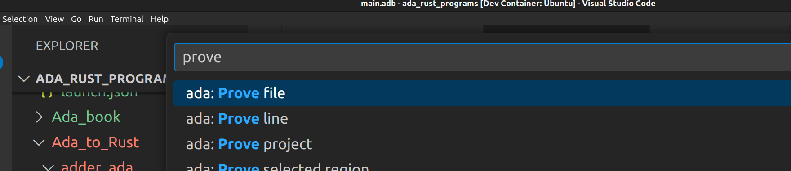

# ada_rust_programs

Ada/Spark and Rust programs as support of [master thesis](https://github.com/Dajamante/thesis_rust_spark_joy).

## Contents

### Ada book:

Those are snippets coming from [LearnAda](https://learn.adacore.com/).

### Ada to Rust

In Ada to Rust programs, all files are in the same source. A compilation script is usually:

```
set -e //makes the build fail if an error happens

gcc -O0 -c -gnatRj record_access.adb -gnat2022 // -gnatRj shows the size of the object and -gnat2022 convention authorize `Img.
rustc --crate-type=staticlib change.rs -g
gnatbind record_access
gnatlink record_access -pthread -l:libchange.a -g //pthread prevents a bunch of errors
```

To use :
Terminal > Run Task > Prove

This seems to be "working":
```
$ export PATH="/workspaces/ada_rust_programs/gnatprove-x86_64-linux-12.1.0-1/bin/:$PATH"
$ gnatprove -P  panicking.gpr 
```

It is mostly useless but can show errors:

In `Rust_to_Ada/ada_adder/adder`:
```
$ gnatprove -P  adder.gpr 
Phase 1 of 2: generation of Global contracts ...
Phase 2 of 2: flow analysis and proof ...

adder.ads:10:55: medium: pointer dereference check might fail
   10 |     Annotate => (GNATprove, Terminating), Post => (X.all'Old = X.all + 1),
      |                                                    ~~^~~
warning: no bodies have been analyzed by GNATprove
enable analysis of a non-generic body using SPARK_Mode
```
#### Usual troubleshooting

`error: failed to run custom build command for openssl-sys v0.9.82`

Requires:
```
sudo apt-get update
sudo apt install pkg-config
sudo apt-get install libudev-dev
```

Valgrind can be run:

`valgrind --tool=memcheck --leak-check=full --show-leak-kinds=all --track-origins=yes ./record_access`

### Rust to Ada

Rust to Ada uses [`gpr`](https://github.com/jklmnn/gpr-rust).

#### Inspect and graphs:

First a `cargo new project-name` is done, and inside we have `alr init --lib lib-name`.

`gpr` needs to be imported in `[build-dependencies]`. 

To do look at mir:

`LD_LIBRARY_PATH=adder/lib cargo rustc -- -Z unpretty=hir,typed > output.mir`

To do graph files that can be visualised in [Graphviz](https://dreampuf.github.io/GraphvizOnline).
`LD_LIBRARY_PATH=adder/lib cargo rustc -- -Z unpretty=mir-cfg > output-graph.dot`

[Source](https://users.rust-lang.org/t/how-to-inspect-hir-or-mir/37135/3
)


Valgrind can be run as usual:

`valgrind --tool=memcheck --leak-check=full --show-leak-kinds=all --track-origins=yes target/debug/ada_string_overwriter`

Assembler output:

`LD_LIBRARY_PATH=adder/lib cargo rustc -- --emit asm --emit asm-verbose`

Objdump with header files:

`objdump -h target/debug/ada_string_overwriter`

#### Usual troubleshooting:
  
`thread 'main' panicked at 'called Result::unwrap() on an Err value: Gpr { code: CallError, name: "GPR2.PROJECT_ERROR", message: "/workspaces/ada_rust_programs/Rust_to_Ada/ada_adder/ada_adder/adder.gpr: fatal error, cannot load the project tree" }', build.rs:6:72`

^^ This means the name is wrong or the path is wrong. The `LD_LIBRARY_PATH` is not compulsory and can be set in `.vscode/` config folder:

```json
"version": "0.2.0",
"configurations": [
    {
        "type": "lldb",
        "request": "launch",
        "name": "Debug",
        "program": "${workspaceFolder}/Rust_to_Ada/ada_string_overwriter/target/debug/ada_string_overwriter",
        "env": {
            "LD_LIBRARY_PATH": "${workspaceRoot}/Rust_to_Ada/ada_string_overwriter/overwriter/lib"
        },
        "args": [],
        "cwd": "${workspaceFolder}"
    }
]
```

Compiler complains about `-fPIE` --> Try  a standalone library instead, replace contents of gpr file.

`.gpr` gile:
```
project Ada_Overwriter
is

   for Source_Dirs use ("src");
   for Object_Dir use "obj";
   for Create_Missing_Dirs use "True";
   for Library_Name use "overwriter";
   for Library_Kind use "dynamic";
   for Library_Standalone use "encapsulated";
   for Library_Interface use ("overwriter");
   for Library_Dir use "lib";

end Ada_Overwriter;
```
That stuff seems to work 

If it is not building, try `gprbuild` inside the Ada lib folder, then `eval $(alr -q printenv --unix)` before running with cargo. 
This exports the environment that alire is using to build the project to the shell. Mainly the path to the compiler and dependency projects. So `gprbuild` will find the correct compiler and dependencies.

Alr looks at the alire.toml that specifies the required dependencies. It downloads them and sets the correct GPR_PROJECT_PATH to them. So when you use one of these dependencies in your gpr file it will be found by gprbuild (which is called by alr). If you with a package that is not specified in the alire.toml you will also get an error.

ldd checks if the dependencies of a library are met (did not use this one that much):

`ldd /workspaces/ada_rust_programs/Rust_to_Ada/ada_string_overwriter/overwriter/lib/liboverwriter.so`